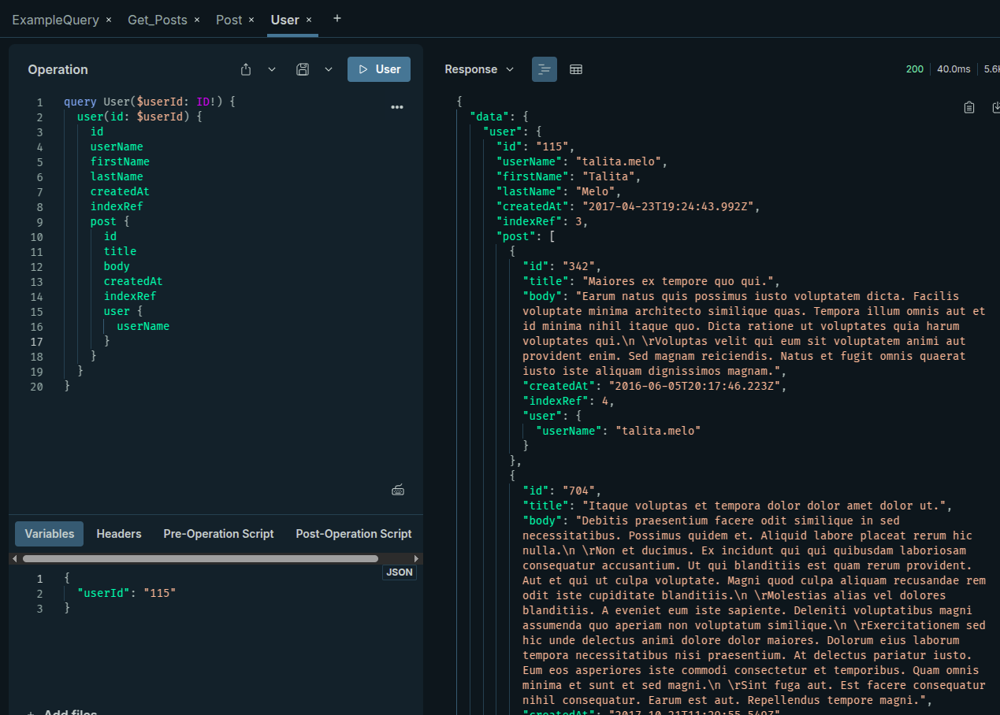
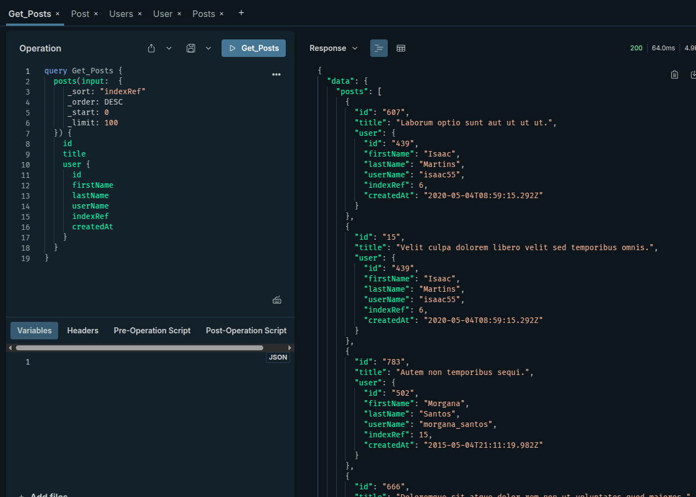
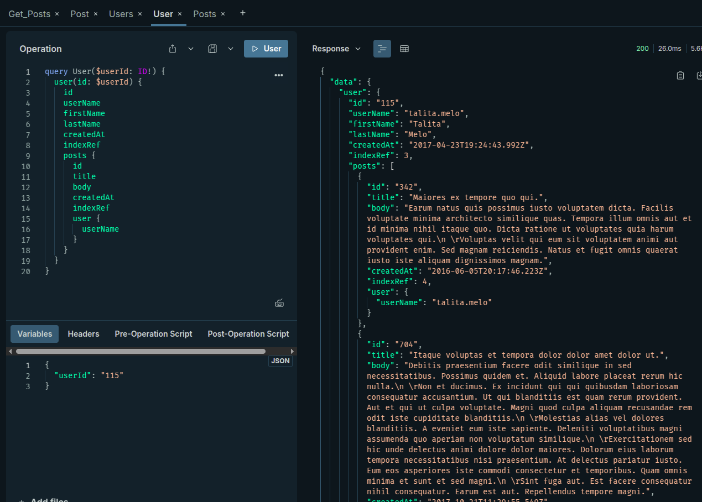

## Dataloader

```
query Get_Posts {
  posts {
    id
    title
    user {
      id
      firstName
      lastName
      userName
      indexRef
      createdAt
    }
  }
}
```

### Relação de N para 1



## DataSource




